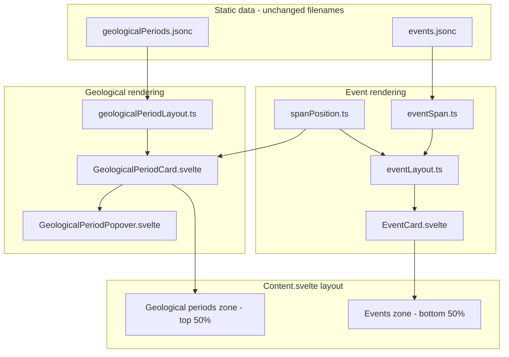

# Event uncertainty spans

Implementation plan for zoom-dependent event uncertainty spans (README UX **#3**). The [README TODO](../../README.md#todo) lists a short summary; this document is the full spec.

**Status:** Implemented. See [`eventLayout.ts`](../../src/lib/utils/eventLayout.ts), [`eventSpan.ts`](../../src/lib/utils/eventSpan.ts), [`spanPosition.ts`](../../src/lib/utils/spanPosition.ts), and [`EventCard.svelte`](../../src/lib/components/main/content/EventCard.svelte).

**Prerequisite:** complete README UX **#1** (timeline as content background) first. Uncertainty spans and the events/geological zones should render above the shared [`TimelineGrid`](../../src/lib/components/main/content/TimelineGrid.svelte) tick layer inside `Content`.

## Architecture overview

---

## Implemented behavior

### Date range

`getEventDateRange()` in [`eventSpan.ts`](../../src/lib/utils/eventSpan.ts):

- `{ start, end } = date ± dateUncertainty/2` when uncertainty is present
- Point range at `date` when `dateUncertainty` is `null` or `0`

### Display tiers (no hysteresis)

| Tier | Condition |
|------|-----------|
| `point` | No uncertainty, or span `< 1px` |
| `range` | `1px ≤ span < EVENT_CARD_WIDTH` |
| `period` | `span ≥ EVENT_CARD_WIDTH` |

### Shared span positioning

[`spanPosition.ts`](../../src/lib/utils/spanPosition.ts) — `getClampedSpanPosition()` used by geological periods and events.

### Events zone

Bottom 50% of the foreground area above the label band (`EVENTS_ZONE_HEIGHT_RATIO` in [`layout.ts`](../../src/lib/constants/layout.ts)).

### Vertical lane stacking

[`eventLayout.ts`](../../src/lib/utils/eventLayout.ts) — overlap on rendered card + anchor bounds, greedy lanes, uniform compression.

### Edge blur

[`SpanBand.svelte`](../../src/lib/components/main/content/SpanBand.svelte) + [`spanBandStyle.ts`](../../src/lib/utils/spanBandStyle.ts) — shared with geological periods (neighbor blending for periods; `fadeEdges` for event period tier).

### 1px marker alignment

Point-tier markers use `w-px` and `snapLayoutX()` — same positioning formula as timeline ticks.

---

## Remaining follow-ups

- **Per-event colors** — optional `color` field on events (type + `getEventColor()` util)
- **Date range formatting** — `formatDateRange()` / `formatDateWithUncertainty()` in [`formatters.ts`](../../src/lib/utils/formatters.ts)
- **Timeline as content background** (README UX #1) — label band refactor
- Geological period uncertainty rendering (`startUncertainty` / `endUncertainty`) — separate future task
- Images in detail views
