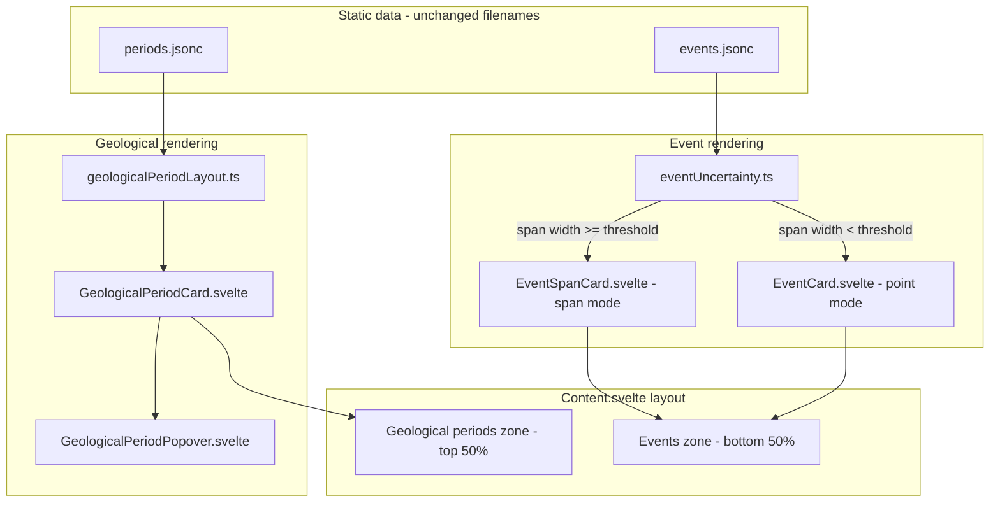

# Geological periods rename + uncertainty spans

Detailed implementation plan for the geological periods rename (Phase 1) and zoom-dependent event uncertainty spans (Phase 2). The [README TODO](../../README.md#todo) lists a short summary; this document is the full spec.

## Architecture overview



---

## Phase 1 — Rename to "geological periods" (standalone, ship first)

Goal: eliminate ambiguity before any uncertainty work. **No behavior change** beyond naming and `localStorage` key migration.

### Types and store

- In [`src/lib/types/index.ts`](../../src/lib/types/index.ts): rename `Period` → `GeologicalPeriod`. Keep `parentPeriodId` as-is (it refers to geological hierarchy).
- In [`src/lib/stores/displayStore.ts`](../../src/lib/stores/displayStore.ts):
  - `showPeriods` → `showGeologicalPeriods`
  - Migrate persisted settings: `parsed.showGeologicalPeriods ?? parsed.showPeriods ?? true`

### File and symbol renames

| Current | New |
|---------|-----|
| `PeriodCard.svelte` | `GeologicalPeriodCard.svelte` |
| `PeriodPopover.svelte` | `GeologicalPeriodPopover.svelte` |
| `periodLayout.ts` | `geologicalPeriodLayout.ts` |
| `Period`, `PeriodWithLayout`, `buildVisiblePeriodLayouts`, etc. | `GeologicalPeriod`, `GeologicalPeriodWithLayout`, `buildVisibleGeologicalPeriodLayouts`, etc. |

Keep **`static/periods.jsonc`** filename and fetch URL unchanged (Docker mount, stable public path).

### DOM attributes and selectors

Rename for consistency with future `EventSpanCard`:

- `data-period-card` → `data-geological-period-card`
- `data-period-popover` → `data-geological-period-popover`

Update consumers in [`Main.svelte`](../../src/lib/components/main/Main.svelte) (deselect-on-tap) and [`app.css`](../../src/app.css).

### Content orchestration

In [`Content.svelte`](../../src/lib/components/main/content/Content.svelte):

- `periods` → `geologicalPeriods`
- `topCardType: "period"` → `"geological_period"`
- `topCardPeriodId` → `topCardGeologicalPeriodId`
- `PERIODS_ZONE_HEIGHT_RATIO` → `GEOLOGICAL_PERIODS_ZONE_HEIGHT_RATIO` in [`layout.ts`](../../src/lib/constants/layout.ts)

### User-facing strings

- [`DisplayToggles.svelte`](../../src/lib/components/header/DisplayToggles.svelte): "Geological periods" / "Périodes géologiques"; aria labels updated
- [`Content.svelte`](../../src/lib/components/main/content/Content.svelte) empty-state messages
- [`README.md`](../../README.md) and [`.cursor/rules/event-handling.mdc`](../../.cursor/rules/event-handling.mdc)

### API helper

- [`src/lib/api.ts`](../../src/lib/api.ts): `fetchPeriods` → `fetchGeologicalPeriods` (if still referenced)

**Phase 1 exit criteria:** `bun run check` and `bun run build` pass; toggles and geological period cards behave identically.

---

## Phase 2 — Zoom-dependent uncertainty spans

Goal: when `dateUncertainty` is visually meaningful at the current zoom, render an event as a horizontal span in the **events zone** (lower band); otherwise keep the existing point marker + card.

Data files stay separate (`events.jsonc` / `periods.jsonc`). No merge.

### 1. Extend `Event` type for future colors

In [`src/lib/types/index.ts`](../../src/lib/types/index.ts):

```ts
export interface Event {
  // ...existing fields...
  /** Optional display color (hex). Falls back to theme accent when absent. */
  color?: string | null
  dateUncertainty: number | null  // align type with JSONC (some entries are null)
}
```

- Add `getEventColor(event: Event): string` in a small util (e.g. [`src/lib/utils/eventColors.ts`](../../src/lib/utils/eventColors.ts)) defaulting to `var(--theme-accent)` or a fixed palette entry.
- **Do not bulk-populate** `events.jsonc` colors in this phase; the field is optional so spans and future point cards can use per-event colors when data is added later.

### 2. Uncertainty threshold utility

New [`src/lib/utils/eventUncertainty.ts`](../../src/lib/utils/eventUncertainty.ts):

| Function | Purpose |
|----------|---------|
| `getEventDateRange(event)` | Returns `{ start, end }` from `date ± uncertainty/2`; `null` uncertainty → zero-width range at `date` |
| `getEventSpanWidthPx(range, yearsPerPixel)` | Pixel width of the uncertainty span |
| `isEventSpanMode(event, yearsPerPixel, previousMode?)` | Pixel threshold with hysteresis |

**Proposed defaults** (tunable constants in same file):

- Enter span mode: span width ≥ **12 px**
- Exit span mode: span width < **8 px**
- `dateUncertainty` is `null` or `0` → always point mode

Hysteresis avoids flicker when zooming near the boundary.

### 3. Shared horizontal span positioning

Extract a pure function from the positioning logic in [`GeologicalPeriodCard.svelte`](../../src/lib/components/main/content/GeologicalPeriodCard.svelte) into [`src/lib/utils/spanPosition.ts`](../../src/lib/utils/spanPosition.ts):

```ts
getClampedSpanPosition({ start, end, leftEdgeYear, rightEdgeYear, yearsPerPixel })
// → { x, width }
```

Used by both `GeologicalPeriodCard` (refactor) and new `EventSpanCard`.

### 4. Explicit two-zone layout in Content

Today geological periods occupy the top 50% overlay; event cards sit at `bottom: 20px` on the full container. Formalize:

```text
┌─────────────────────────────────────┐
│  Geological periods zone (top 50%)  │
├─────────────────────────────────────┤
│  Events zone (bottom 50%)           │
│    - EventSpanCard (uncertainty)    │
│    - EventCard (point mode)         │
└─────────────────────────────────────┘
```

- Add `eventsZoneElement` + `eventsZoneHeight` (mirror geological zone `ResizeObserver` pattern in [`Content.svelte`](../../src/lib/components/main/content/Content.svelte))
- Add `EVENTS_ZONE_HEIGHT_RATIO = 1 - GEOLOGICAL_PERIODS_ZONE_HEIGHT_RATIO` in [`layout.ts`](../../src/lib/constants/layout.ts)
- Pin events zone: `absolute bottom-0 left-0 right-0`
- Move `EventCard` positioning to be relative to the events zone height (not full content height)

### 5. New `EventSpanCard.svelte`

Lower-band counterpart to `GeologicalPeriodCard`, but simpler:

- Input: `event`, viewport props, `zoneHeight`, selection/hover state
- Position via `getClampedSpanPosition(getEventDateRange(event), ...)`
- Background: `event.color ?? getEventColor(event)` (solid fill; no left/right neighbor gradient unless desired later)
- Optional thin center tick at `event.date` so the best-estimate date remains visible on the span
- `data-event-span-card` attribute (distinct from `data-event-card` for deselect logic)
- Same `bindPointerClick` / z-index tiers as event cards
- Title inside span when width/height permit (reuse char-width heuristic from geological card)
- Selected state: popover or expanded inline detail showing **date range** via new formatter

### 6. Bifurcate event rendering in Content

Replace flat `visibleEvents` loop with:

```ts
const visibleEvents = $derived(/* range-overlap filter, not point-only */)

const eventDisplayModes = $derived(
  visibleEvents.map(event => ({
    event,
    mode: isEventSpanMode(event, yearsPerPixel) ? "span" : "point",
  }))
)
```

**Visibility filter change** (important): overlap test on date range, not `event.date` alone:

```
range.end >= leftEdgeYear && range.start <= rightEdgeYear
```

Render `{#if mode === "span"}` → `EventSpanCard`, else → `EventCard`.

Selection state stays on `topCardEventId` for both modes (same event, different representation).

Update [`Main.svelte`](../../src/lib/components/main/Main.svelte) deselect targets: `[data-event-card]`, `[data-event-span-card]`, `[data-geological-period-card]`, `[data-geological-period-popover]`.

### 7. Date range formatting

Extend [`formatters.ts`](../../src/lib/utils/formatters.ts):

- `formatDateRange(start, end, locale)` for span detail labels
- `formatDateWithUncertainty(date, uncertainty, locale)` for point-mode cards (show `±` when uncertainty exists but span is too narrow to render)

Use in `EventSpanCard` detail and optionally in selected `EventCard`.

### 8. Documentation

Update [`README.md`](../../README.md) TODO:

- Mark uncertainty visualization as implemented (or in progress)
- Note optional `color` on events for future data entry
- Rename remaining "period" references to "geological period"

Update [`.cursor/rules/event-handling.mdc`](../../.cursor/rules/event-handling.mdc) with span-mode rules, new data attributes, and events-zone positioning.

---

## Out of scope (follow-ups)

- Lane stacking for overlapping event spans/cards (existing Phase 2 vertical stacking TODO)
- Populating `color` in `events.jsonc`
- Merging `periods.jsonc` and `events.jsonc`
- Geological period uncertainty rendering (`startUncertainty` / `endUncertainty`) — separate future task
- Images in detail views

---

## Suggested delivery order

1. **PR 1:** Phase 1 only (rename) — merge independently
2. **PR 2:** Phase 2 (uncertainty spans + event color field + zone split)

This keeps review focused and ensures "geological periods" naming is correct regardless of whether span work ships immediately.
