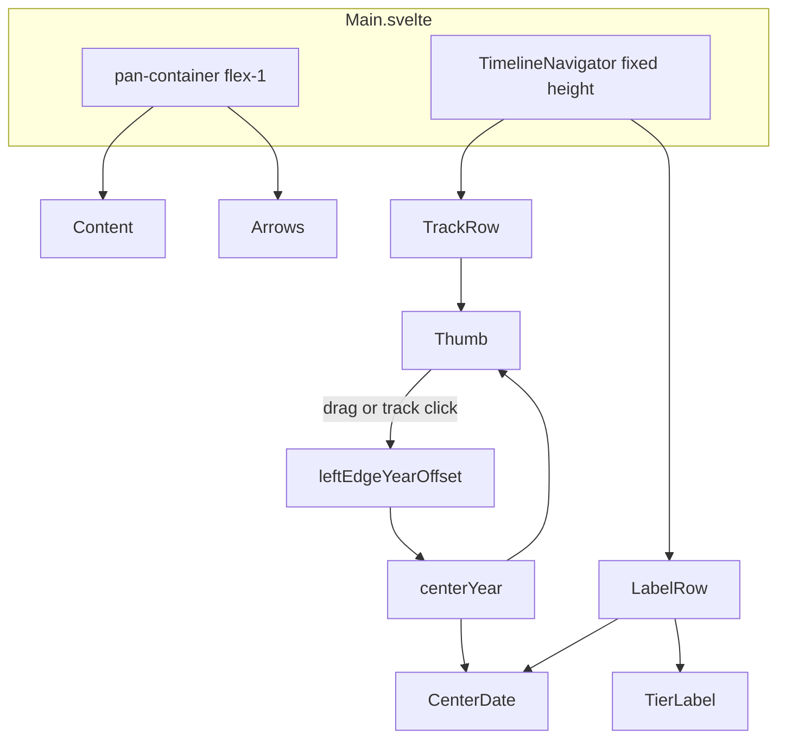

# Timeline navigator

Implementation plan for README UX **#2**. Prerequisite [#1 — Timeline as content background](timeline-as-content-background.md) is done: ticks live inside `Content`; vertical space is ready for the navigator below `pan-container`.

## Goal

Give users a **coarse, always-visible** sense of where they are in the 13.8-billion-year axis and a fast way to jump across eras — without reintroducing tick labels in a separate strip (those now live in the content label band).



## Chosen design

### Placement

- Sibling of `pan-container`, **not** inside it — navigator interactions must not trigger content pan/deselect ([`Main.svelte`](../../src/lib/components/main/Main.svelte) `handlePointerDown`).
- Structure in `Main.svelte`:

```text
<main>                          ← flex-col
  DebugInfo (optional)
  <div class="pan-container">     ← flex-1, wheel + pan
    Content, arrows
  </div>
  <TimelineNavigator />         ← flex-shrink-0, ~52px
</main>
```

### Two-row layout (~48–56px total)

| Row | Height (~) | Content |
|-----|------------|---------|
| Upper | ~28px | Full-width track (`bg-border/60`); scrollbar-style thumb (`bg-accent`, rounded, fixed min width) |
| Lower | ~24px | Center date under thumb (edge-clamped); zoom tier label (right-aligned) |

Proposed constants in [`layout.ts`](../../src/lib/constants/layout.ts):

- `TIMELINE_NAVIGATOR_HEIGHT_PX = 52`
- `TIMELINE_NAVIGATOR_TRACK_HEIGHT_PX = 28`
- `TIMELINE_NAVIGATOR_THUMB_MIN_WIDTH_PX = 28` — **fixed**, does not scale with `viewportYearSpan`

### Axis mapping (differs from content)

Content maps **viewport slice** → pixels (`yearsPerPixel`). The navigator maps the **entire timeline** → track width:

```ts
totalSpan = TIME_CONSTANTS.END_YEAR - TIME_CONSTANTS.START_YEAR
trackX = ((year - START_YEAR) / totalSpan) * trackWidth
year   = START_YEAR + (trackX / trackWidth) * totalSpan
```

Thumb **center** follows `centerYear` (already derived in `Main.svelte`). Thumb width stays constant; only horizontal position changes.

### Interactions

1. **Thumb drag** — pointer capture on thumb; map pointer → track X via existing [`screenToTimelineX`](../../src/lib/utils/timelineCoordinates.ts) (handles forced-landscape rotation); convert to year; re-center viewport on that year.
2. **Track click** — pointerdown on track (not thumb): jump viewport center to clicked year (same centering math, no drag threshold).
3. **Live label** — `centerYear` is `$derived` from `leftEdgeYearOffset`; navigator receives it as a prop and updates on every pan (main drag, arrows, wheel, thumb).

### Centering + boundary clamp (shared with zoom/pan)

Thumb drag and track click both need the same logic as `performCenteredZoom`:

```ts
newOffset = targetCenterYear - START_YEAR - (viewportWidth * yearsPerPixel) / 2
// then clamp so [leftEdge, rightEdge] stays within [START_YEAR, END_YEAR]
```

Extract this into [`timelineViewport.ts`](../../src/lib/utils/timelineViewport.ts) per [`.cursor/rules/main-svelte.mdc`](../../.cursor/rules/main-svelte.mdc):

- `computeCenteredLeftEdgeOffset(centerYear, viewportWidth, yearsPerPixel): number`
- `clampLeftEdgeOffset(offset, viewportWidth, yearsPerPixel): number`

Refactor `performCenteredZoom`, wheel pan, arrow pan, and content pan in `Main.svelte` to call these helpers (small dedupe, avoids navigator/main drift).

### Label row layout

- **Center date**: `formatDate(centerYear, $currentLocale)` — reuse [`formatters.ts`](../../src/lib/utils/formatters.ts).
- **Position**: centered under thumb center X, with edge clamping (same pattern as `getEventCardXPosition` in [`EventCard.svelte`](../../src/lib/components/main/content/EventCard.svelte): keep text box inside track bounds).
- **Tier label**: human-readable, localized string from `currentScale.tierId` ([`zoom.ts`](../../src/lib/constants/zoom.ts) tiers: `universe`, `hundred-million`, `ten-million`, `million`, `hundred-thousand`, `ten-thousand`, `thousand`, `century`). Add `formatZoomTierLabel(tierId, locale)` in `formatters.ts` with an `en`/`fr` map (no new store).

### Wheel handler scope

Today `onwheel={handleWheel}` is on `<main>`, so wheeling over the navigator would pan/zoom the timeline. **Move `handleWheel` to `pan-container` only** so the navigator strip is inert to scroll gestures.

### Styling

- Tailwind only; theme tokens (`bg-surface`, `border-border`, `text-muted`, `bg-accent`).
- `border-t border-border` between content and navigator (mirrors old `TimelineZone` separator).
- `touch-action: none` on navigator root (like `.pan-container`) so touch drag is not stolen by the browser.
- Thumb: `cursor-grab` / `grabbing`, `aria-label="Timeline position"`, optional `role="slider"` with `aria-valuenow={centerYear}`.

### Debug overlay (`PUBLIC_DEBUG=true`)

Extend [`DebugInfo.svelte`](../../src/lib/components/main/DebugInfo.svelte) with a **Navigator** section (same panel, gated by existing `PUBLIC_DEBUG` check in `Main.svelte`). Keeps navigator geometry visible when tuning thumb alignment, edge clamping, and forced-landscape drag.

**Data flow:** `TimelineNavigator` reports `trackWidth` to `Main.svelte` (e.g. `onTrackWidthChange` callback from its `ResizeObserver`). `Main` derives thumb/label metrics via [`timelineNavigator.ts`](../../src/lib/utils/timelineNavigator.ts) and passes them as props — `DebugInfo` stays presentational, matching the existing Zoom/Viewport/Tick sections.

**New props (sketch):**

```ts
// Navigator geometry
navigatorTrackWidth: number
tierId: string
thumbCenterX: number
thumbLeftX: number
thumbWidth: number
navigatorYearsPerPixel: number
centerTimelinePercent: number   // 0–100, position on full axis
labelCenterX: number
isLabelClamped: boolean
```

**Derived in `Main.svelte` (not in the component):**

```ts
totalSpan = END_YEAR - START_YEAR
thumbCenterX = yearToTrackX(centerYear, navigatorTrackWidth)
thumbLeftX = thumbCenterX - thumbWidth / 2
navigatorYearsPerPixel = navigatorTrackWidth / totalSpan
centerTimelinePercent = ((centerYear - START_YEAR) / totalSpan) * 100
labelCenterX = clampCenteredLabelX(thumbCenterX, navigatorTrackWidth, labelWidthEstimate)
isLabelClamped = labelCenterX !== thumbCenterX
```

**Panel fields to display:**

| Field | Purpose |
|-------|---------|
| Track width | Confirms `ResizeObserver` width matches visual track |
| Total span | Full-axis year range (sanity check vs `TIME_CONSTANTS`) |
| Navigator years/px | Full-timeline scale (distinct from content `yearsPerPixel`) |
| Tier ID | Raw `tierId` from current zoom scale |
| Thumb center / left (px) | Verify thumb follows `centerYear` on track |
| Thumb width (px) | Confirms fixed width constant |
| Center on axis (%) | Quick read of viewport position on 0–100% scale |
| Label center (px) | Verify label row positioning |
| Label clamped | YES when date text is edge-pinned (differs from thumb center) |

Use `formatLargeNumber` / `toFixed(1)` for numeric values; reuse `formatZoomTierLabel` for a human-readable tier line if useful alongside raw `tierId`.

## Implementation outline

1. **Add navigator constants** to [`layout.ts`](../../src/lib/constants/layout.ts) and export from [`constants/index.ts`](../../src/lib/constants/index.ts).
2. **Create [`timelineViewport.ts`](../../src/lib/utils/timelineViewport.ts)** — `computeCenteredLeftEdgeOffset`, `clampLeftEdgeOffset`; refactor `Main.svelte` pan/zoom to use it.
3. **Create [`timelineNavigator.ts`](../../src/lib/utils/timelineNavigator.ts)** — `yearToTrackX`, `trackXToYear`, `clampCenteredLabelX`.
4. **Add `formatZoomTierLabel`** to [`formatters.ts`](../../src/lib/utils/formatters.ts) (en/fr).
5. **Build [`TimelineNavigator.svelte`](../../src/lib/components/main/TimelineNavigator.svelte)** — track, thumb drag, track click, label row; report `trackWidth` to parent on resize.
6. **Wire in [`Main.svelte`](../../src/lib/components/main/Main.svelte)** — mount navigator below `pan-container`; pass `centerYear`, `tierId`, `onNavigateToCenterYear`; move `onwheel` to `pan-container`; derive navigator debug metrics and pass to `DebugInfo`.
7. **Extend [`DebugInfo.svelte`](../../src/lib/components/main/DebugInfo.svelte)** — add Navigator section with track width, thumb position, axis %, tier ID, label clamp status (only when `PUBLIC_DEBUG=true`).

### `TimelineNavigator` props (sketch)

```ts
interface Props {
  centerYear: number
  tierId: string
  trackWidth: number          // from ResizeObserver on root
  onNavigateToCenterYear: (year: number) => void
}
```

`Main.svelte` implements `onNavigateToCenterYear` by computing clamped `leftEdgeYearOffset` via `timelineViewport.ts`.

### `TimelineNavigator` drag details

- **Thumb drag**: on pointerdown, store `grabOffsetX = pointerTrackX - thumbCenterX` so the thumb does not jump under the finger; on move, `year = trackXToYear(pointerTrackX - grabOffsetX)`.
- **Track click**: ignore if target is thumb; on pointerup with movement ≤ `POINTER_DRAG_THRESHOLD_PX`, jump to `trackXToYear(pointerTrackX)`.
- `stopPropagation()` on navigator pointer events so they never reach `pan-container`.

## Exit criteria

- `bun run check` and `bun run build` pass
- Navigator sits below content, outside `pan-container`, ~52px tall
- Thumb position tracks viewport center while panning (main drag, arrows, wheel, footer zoom)
- Thumb drag and track click re-center viewport with correct boundary clamp at Big Bang / present day
- Center date and tier label update live; date stays readable at track edges (clamped)
- Wheel over navigator does not pan/zoom; wheel over content still works
- Forced-landscape (rotated portrait) thumb drag aligns with content axis
- With `PUBLIC_DEBUG=true`, DebugInfo shows navigator track width, thumb position (px), center-on-axis %, tier ID, and label clamp status

## Out of scope (follow-ups)

- Shareable URL state (README UX **#7** — numbering unchanged)
- Tick marks on navigator track
- Keyboard slider navigation
- Proportional thumb width (explicitly excluded by spec)

## README

When shipped, tick README UX **#2**.
